# Fleet Cost Optimizer

**A MyGeotab Add-In that turns raw telematics data into a prescriptive 90-day action plan.**

One click. 30 seconds. Tells your fleet manager exactly who to call, what to fix, and by when — with dollar amounts attached.

  

<div align="center">

### 🚀 [Watch the Interactive Intro →](https://github.com/SanjayaAbeysinghe/fco-intro-v2.html)
*60-second animated walkthrough — what the tool finds, how it classifies, and the 90-day plan it builds*

</div>

---

## 🔴 The Problem

MyGeotab has over 100 built-in reports. Here's what a fleet manager sees when they open the reports page:

<div align="center">
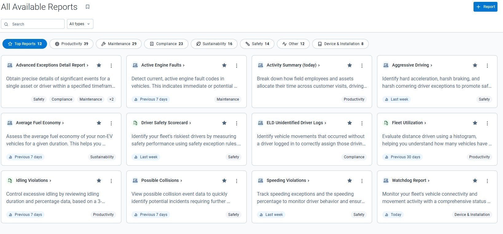
</div>

Twelve categories. 39 productivity reports. 29 maintenance reports. 14 safety reports. Each one answers a single question — "which vehicles were idling?" or "who had fault codes?" — but none of them connect the dots. A fleet manager has to open 5-6 different reports, mentally cross-reference the data, figure out which findings actually matter, decide who should handle each one, and then somehow track whether anything got done.

The gap between "seeing the numbers" and "knowing what to do" costs real money. For this demo fleet of 50 vehicles, that gap is **$10,843/month.**

> *"Why not just use the built-in Fleet Utilization Report?"* — See [Appendix A](#appendix-a-fleet-utilization-report-comparison) for a side-by-side comparison.

---

## 🟢 What Fleet Cost Optimizer Does

One button replaces those 5-6 reports with a single audit that tells you what's wrong, how much it costs, who fixes it, and by when.

### Executive Summary

<div align="center">
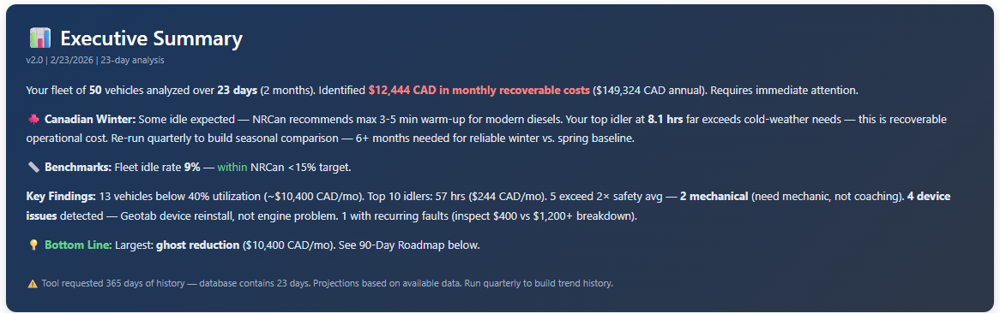
</div>

The first thing a fleet manager sees after clicking "Run Audit." Version, date, analysis window (22 days across 2 months), and the headline: **$10,843 CAD/month in recoverable costs.** Three layers of context below:

- **Canadian Winter:** NRCan recommends 3-5 min warm-up max for modern diesels. Top idler at 8.0 hrs is well beyond cold-weather needs.
- **Benchmarks:** Fleet idle rate 9% — within NRCan's 15% target. Good news the tool surfaces, not just problems.
- **Key Findings:** 11 ghost vehicles, 2 mechanical issues, **4 device issues** (not engine problems — Geotab device reinstall). The summary already separates mechanical from device so a fleet manager doesn't waste a mechanic on a firmware fix.

The yellow warning at the bottom is the tool being honest: "Tool requested 365 days of history — database contains 22 days." The tool asks the Geotab API for a full year of trip, fault, and exception data. The demo simulator only has data going back to late January 2025 — so the API returns what it has, which works out to about 22 days spanning Jan 31 to Feb 21. The tool detects this gap automatically and adjusts its confidence level accordingly. On a production fleet with a year of real data, it would use the full 365 days.

### Sustainability & Carbon Impact

<div align="center">
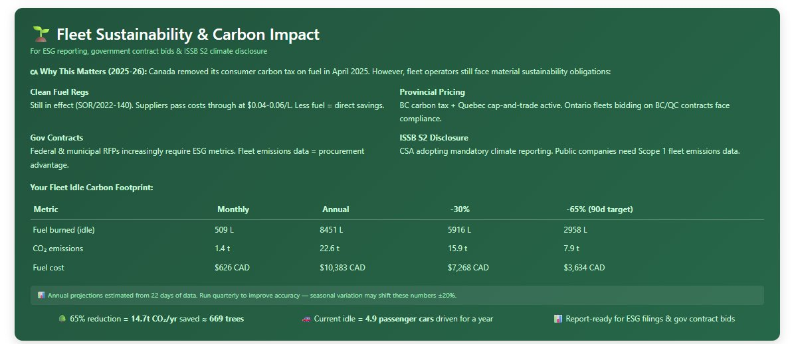
</div>

Not generic "ESG is important" — specific to what a Canadian fleet operator faces in 2026. Four regulatory frameworks mapped: Clean Fuel Regulations (SOR/2022-140, still in effect), provincial carbon pricing (BC carbon tax + Quebec cap-and-trade), government contract ESG requirements, and ISSB S2 climate disclosure via CSA.

The carbon footprint table translates idle hours into numbers a CFO can use: 509L fuel/month, 1.4 tonnes CO₂, $626 CAD. The reduction scenarios show what 30% and 65% cuts would save. The equivalency bar at the bottom — "669 trees" and "4.9 passenger cars" — is for the sustainability report.

### Monthly Idle Trend

<div align="center">
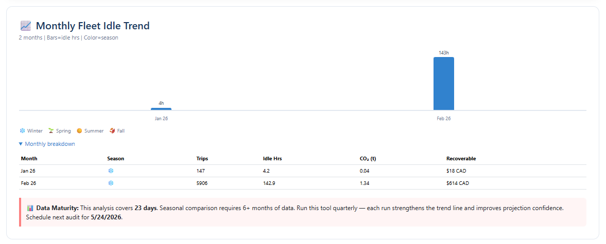
</div>

Bars show idle hours by month, color-coded by season. With only 2 months of data (Jan: 4h, Feb: 141h), the trend is steep — but the pink "Data Maturity" callout explains why. It even schedules the next audit for May 23, 2026. The tool doesn't pretend 22 days is enough for seasonal comparison.

### Total Opportunity

<div align="center">
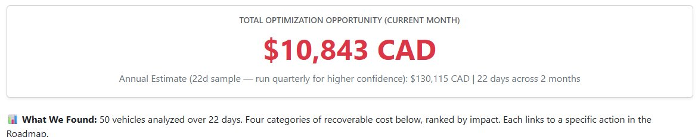
</div>

The anchor number. $10,843 CAD/month. The annual estimate ($130,115) is deliberately caveated: "22d sample — run quarterly for higher confidence." Everything below links back to specific actions in the Roadmap.

---

### 🟡 The Four Finding Cards

Each card is one category of recoverable cost, ranked by impact.

#### Ghost Vehicles — $8,800/mo

<div align="center">
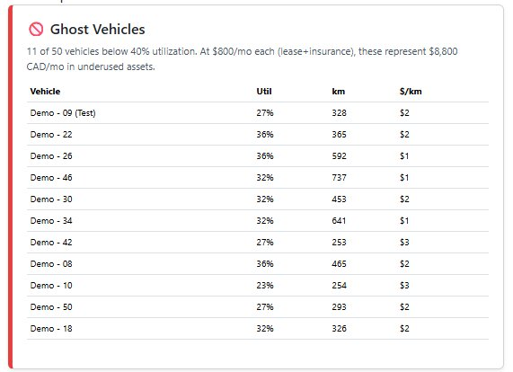
</div>

11 of 50 vehicles below 40% utilization. At $800/mo each (lease + insurance), these are the biggest opportunity. The table shows utilization %, km driven, and cost-per-km so a fleet manager can see that Demo-10 at 23% and $3/km is the worst offender. Utilization is calculated from each vehicle's actual first trip date — not a fixed 30-day window — so new vehicles don't get falsely flagged.

#### Idle Time Burn — $243/mo

<div align="center">
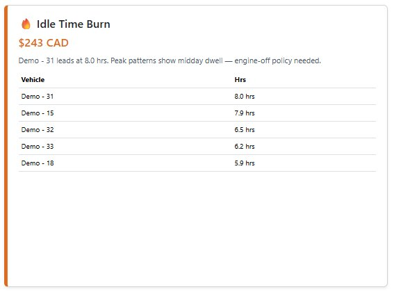
</div>

Demo-31 leads at 8.0 hours. The description identifies the pattern — peak patterns show midday dwell — so the fleet manager knows this needs an engine-off policy. Fuel cost calculated at $4.30/hour using real trip-level idling durations from the Geotab API.

#### High-Risk Driving — $1,000/mo

<div align="center">
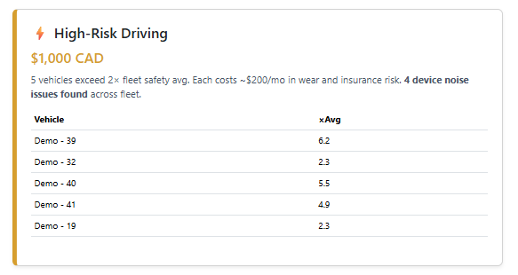
</div>

5 vehicles exceed 2× the fleet safety average. The card already calls out "**4 device noise issues found**" right in the description — so nobody confuses accelerometer mounting problems with dangerous driving. Demo-39 at 6.2× average looks alarming until you realize 15 of its 19 events are device-generated Engine Fault Exceptions, not actual driving behavior.

#### Breakdown Risk — $800/mo

<div align="center">
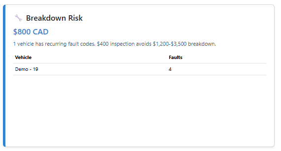
</div>

Demo-19 has 4 recurring fault codes (Low Priority Warning Light × 4, spanning Jan 31 to Feb 20). The recurring pattern — not a one-time glitch — is what triggers the flag. $400 proactive inspection vs $1,200-$3,500 roadside breakdown.

---

## 🔵 The Roadmap — What Makes This Different

Most fleet tools stop at the finding cards. Here's the problem with that: a fleet manager knows Demo-32 has issues, but WHO pulls it from service? WHO calls the mechanic? What fault codes do they mention? When is it due? How do they verify?

The Roadmap answers all of that. Four phases, each with a dollar target showing how waste should decrease.

### URGENT: Safety & Mechanical (This Week)

<div align="center">
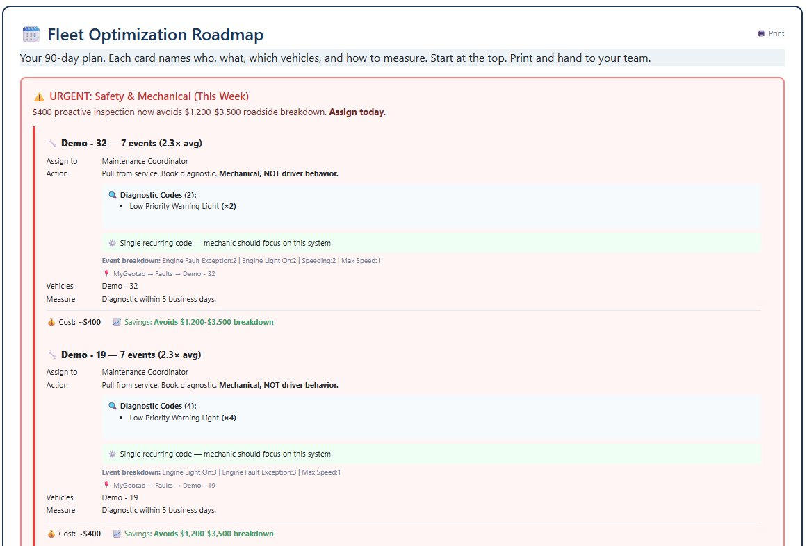
</div>

Each card names **who** (Maintenance Coordinator), **what** (pull from service, book diagnostic), and backs it with data. Demo-32 shows Diagnostic Codes (2): Low Priority Warning Light ×2, with pattern analysis ("single recurring code — mechanic should focus on this system") and the full event breakdown. The MyGeotab navigation path tells the coordinator exactly where to verify: `MyGeotab → Faults → Demo - 32`.

Below the mechanical cards, the DEVICE ISSUE cards (Demo-39, 40, 41, 42) route to IT instead of a mechanic: "NOT an engine fault. Geotab GO device: 111 accelerometer noise records." $0 fix under warranty. This is the 3-way classifier in action — without it, fleet managers send $400 mechanics to fix firmware problems.

### 30-Day Plan: Quick Wins

<div align="center">
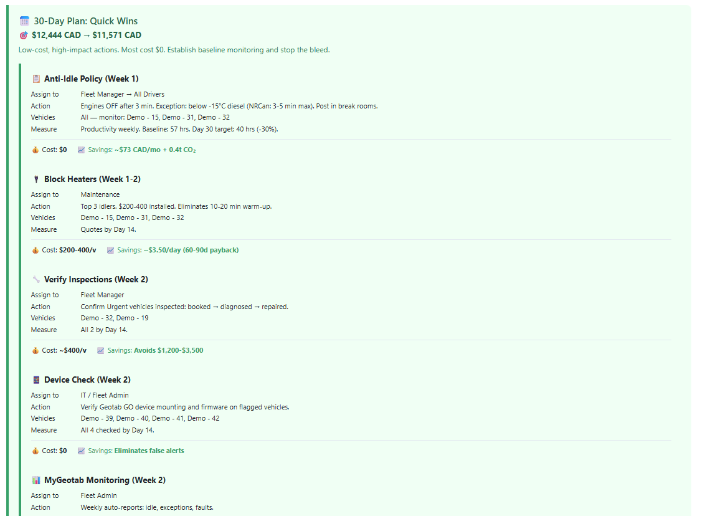
</div>

Target: $10,843 → $9,970. Five action cards, each with a different owner. Anti-Idle Policy (Fleet Manager → All Drivers, engines OFF after 3 min, NRCan cold-weather exception). Block Heaters (Maintenance, top 3 idlers, 60-90 day payback). Verify Inspections (confirm URGENT vehicles were actually seen). Device Check (IT, 4 noise vehicles). MyGeotab Monitoring (weekly auto-reports). Most of these cost $0.

### 60-Day Plan: Measure & Adjust

<div align="center">
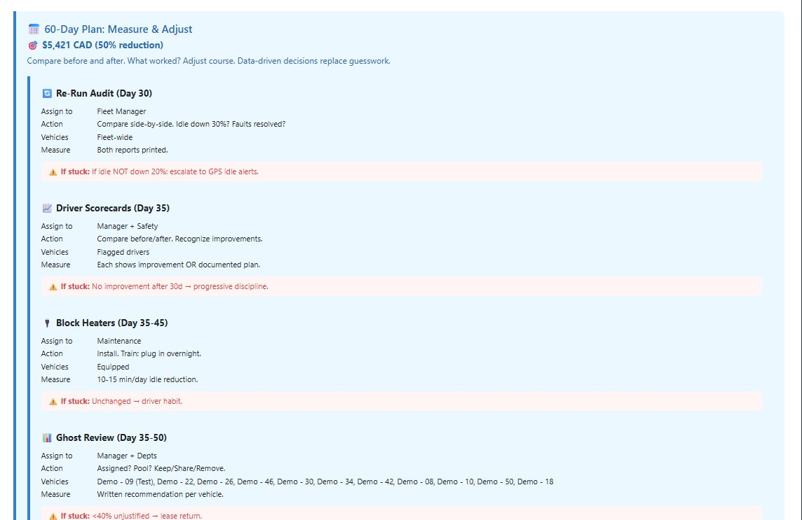
</div>

Target: $5,421 (50% reduction). Compare before and after. The red "If stuck" escalation paths are built in — "If idle NOT down 20%: escalate to GPS idle alerts." "No improvement after 30d → progressive discipline." Ghost Review forces a keep/share/remove decision on all 11 underused vehicles. Each card includes what to do when progress stalls, not just the happy path.

### 90-Day Plan: Systematize

<div align="center">
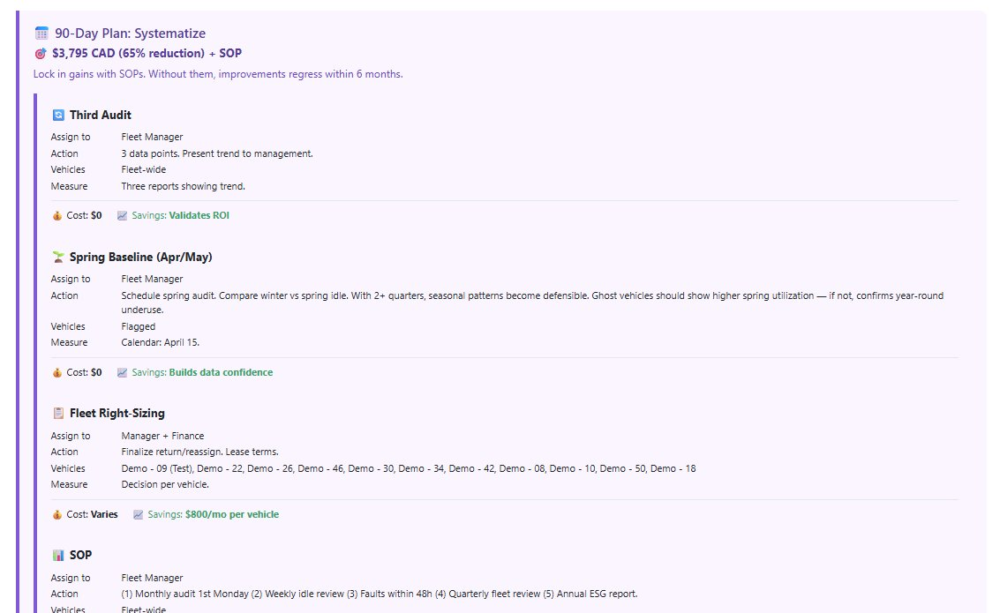
</div>

Target: $3,795 (65% reduction) + SOP. Third Audit gives 3 data points for trend analysis. Spring Baseline (April) compares winter vs spring — if ghost vehicles still show low utilization in spring, that confirms year-round underuse, not seasonal variation. Fleet Right-Sizing pulls Finance in for lease decisions. SOP codifies everything: monthly audit 1st Monday, weekly idle review, faults within 48h, quarterly fleet review, annual ESG report. Without SOPs, improvements regress within 6 months.

### Progress Tracker

<div align="center">

</div>

Expected metrics at each phase. Recoverable cost declining from $10,843 to $3,795. Idle hours from 57 to 23. High-risk vehicles from 5 to 0. CO₂ from 1.4 to 0.5 tonnes/month. Annual savings at 90d: **$84,575 CAD + 9.8t CO₂.**

### Printable Checklist

<div align="center">
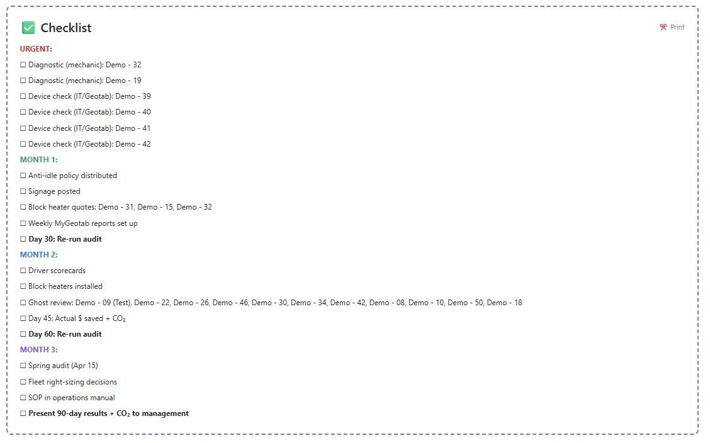
</div>

Every action from the roadmap as a checkbox, grouped by URGENT, Month 1, Month 2, Month 3. Print this page, hand it to your team, track completion with a pen. This is what turns a dashboard into an operations tool.

---

## 🟣 Evidence Report

Data backing every finding. When the boss asks "how do you know Demo-31 is a problem?" — open this section.

<div align="center">
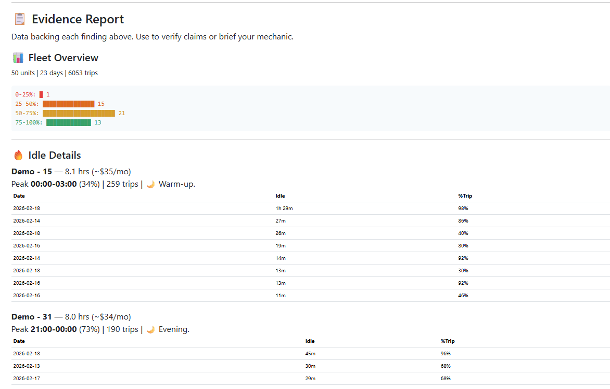
</div>

Fleet Overview shows utilization distribution (1 vehicle at 0-25%, 13 at 25-50%, 21 at 50-75%, 15 at 75-100%). Each idle vehicle gets trip-level detail — Demo-31's peak is **21:00-00:00** (73% of idle happens evening, not warm-up). The trip table shows individual high-idle trips with date, idle duration, and what percentage of that trip was idle.

<div align="center">
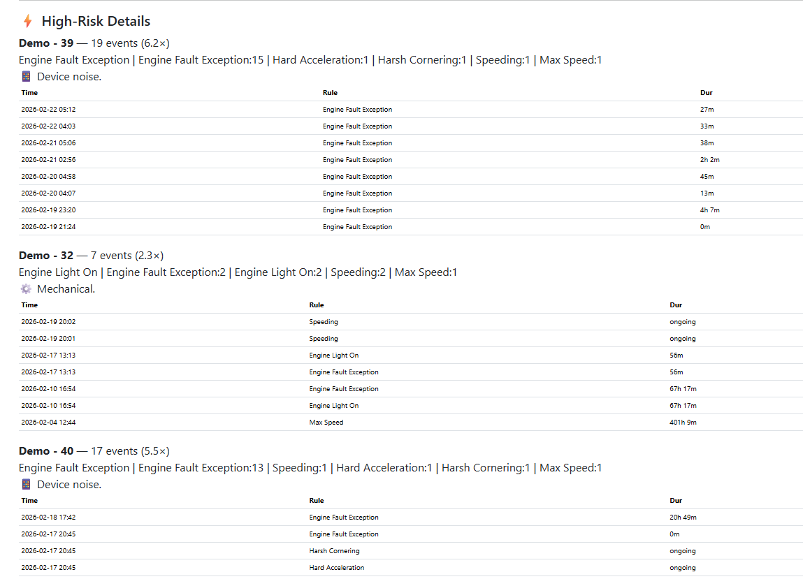
</div>

Demo-39's evidence: 19 events, wall-to-wall Engine Fault Exception at 2-5 AM, tagged "Device noise." The timestamps and durations make it obvious this is automated sensor noise, not a driver speeding at 3 AM. This is the evidence that convinced me to build the 3-way classifier.

---

## ⚠️ Known Limitations

**1. "Mechanical, NOT driver behavior" is too absolute.** Demo-32's card says "Mechanical, NOT driver behavior" — but the event breakdown shows Speeding:2 and Max Speed:1. Three of seven events ARE driver behavior. The classifier picks the dominant type and stamps the whole card, which breaks down when the split is close to 50/50.

**2. Urgency level doesn't match fault severity.** Demo-32 has "Low Priority Warning Light × 2" — the word "Low Priority" is in the diagnostic name. But the URGENT banner says "Pull from service" and prices it at "$400 vs $3,500 breakdown." That response fits a high-priority fault, not two low-priority warnings over 22 days.

**3. Device issues and mechanical issues share the same URGENT banner.** Demo-39's $0 IT ticket sits next to Demo-32's engine faults under the same red header. Mixing them dilutes the real urgency of mechanical flags.

**4. Cost estimates are hardcoded.** Every mechanical vehicle gets "$400 inspection avoids $1,200-$3,500 breakdown" regardless of severity. Every ghost vehicle gets "$800/mo" regardless of vehicle class. These are reasonable industry averages but won't match every fleet's actual numbers.

**5. 22-day sample extrapolated to annual.** The tool flags this ("22d sample — run quarterly") but the $130,115 annual projection is still prominent. Seasonal variation could make it 20-30% off.

**6. Demo-15 idle rounding.** Tool shows 7.9 hrs, Geotab shows 7.6 hrs. Fractional-second rounding accumulated across 254 trips. ~4% variance.

---

## 🔮 Future Roadmap

What I'd build with another sprint, ranked by impact on fleet manager experience:

**Split classification on action cards.** Replace the binary "Mechanical, NOT driver behavior" with "4 of 7 mechanical, 3 of 7 behavioral. Primary: mechanic. Secondary: coaching." Give the fleet manager the full picture.

**Severity-aware urgency tiers.** Parse fault code severity from the diagnostic name. "Low Priority Warning Light" → schedule at next routine service. "Malfunction Indicator Lamp" → pull from service now. Match the response to the actual risk.

**Separate device issues from mechanical in the URGENT section.** Split into "⚠️ Mechanical — Pull from Service" (red) and "📱 Device Issues — IT Ticket" (purple). Device mounting issues aren't emergencies.

**Configurable cost inputs.** A settings panel with actual lease rate, hourly shop rate, and fuel price. Three fields would make every dollar amount match the fleet manager's reality instead of industry averages.

**Ace API chat panel.** A conversational interface where a fleet manager asks "which vehicles should I look at first?" and gets a prioritized answer. Attempted 11 times during development — failed every time. Details in Challenges below.

**Suppress annual estimate under 60 days.** Show it only after 2+ quarterly runs, with a confidence range instead of a point estimate.

---

## 🛠️ Challenges Faced

### The 50KB Wall

MyGeotab Add-In configs have a ~50KB JSON limit. The final file is 49,393 bytes with 607 bytes of headroom. Every feature addition in the last 5 versions required removing something else. The `isN()` helper function saved ~500 bytes by deduplicating 5 copies of the accelerometer filter pattern. This constraint killed the Ace integration and forced aggressive code compression throughout.

### Device Noise Discovery

Three vehicles (Demo-39, 40, 41) had massive exception counts. My tool classified them as mechanical failures needing a mechanic. Cross-validating against the official Geotab Fault Report revealed they were all accelerometer mounting issues — pure device noise. This failure became the tool's best feature: the 3-way classifier. A fourth vehicle (Demo-42) was only caught in v2.0 because the original scan only checked high-event vehicles, not all vehicles.

### 365-Day Request, 22-Day Reality

The tool sends `fromDate` set to 365 days ago in every API call — trips, faults, exceptions, everything. The Geotab demo simulator only holds data from about late January 2025 onward, so the API returns roughly 22 days of records across two calendar months (January and February). The tool doesn't crash or show blanks — it calculates the actual span from the earliest trip timestamp to today and uses that as the denominator for every rate and percentage. The yellow warning banner and the "Data Maturity" callout on the idle trend chart both surface this gap to the user. On a real production fleet with a full year of history, the same code would pull and analyze all 365 days without any changes.

### Ace Integration — 11 Attempts, 0 Successes

I wanted a chat panel where a fleet manager could ask Ace "which vehicles should I look at first?" and get a prioritized answer. The Gem generated 11 different versions of the Ace integration code between v1.2 and v1.3.0, each one using the `dna-planet-orchestration` service with the three-step async pattern: `create-chat`, `send-prompt`, then poll with `get-message-group`.

Every version hit the same wall. The Ace code adds chat creation logic, prompt submission handlers, polling timers, debug logging, and error handling with fallback modes. All of that JavaScript goes inside the HTML string inside the JSON config file — and the Geotab config parser has a size limit around 50KB. Each Ace attempt pushed the total config past the parser's tolerance. The Gem kept trying different approaches — shorter prompts, stripped-down polling, minimal error handling — but the core issue was structural: you can't fit a full async chat SDK into a single-file Add-In that's already at 49KB.

The right fix would be moving the Ace calls to a lightweight server endpoint and having the Add-In call that instead. That's a v3 problem.

### "Config not valid" — The Gem's Hardest Lesson

Between v1.3 and v1.5, the Gem generated 8 consecutive configs that MyGeotab rejected with "The configuration object is not valid." Each time, the Gem's response was confident — "I've verified all strings are escaped, no trailing commas" — and each time, same error.

The root cause wasn't one thing. It was several, stacking up:

The v1.3 attempt added click-to-expand detail panels on every vehicle row. That meant `onclick` handlers with escaped quotes nested inside HTML strings inside JSON strings — three levels of escaping. One missed backslash anywhere and the JSON parser breaks, but the error message doesn't tell you where.

The Gem also kept adding features on top of features. Drill-down panels needed CSS transitions (`.detail-panel`, `.clickable-row`), Bootstrap collapse components, and dynamic content rendering functions. Each addition bloated the HTML string inside the `"audit.html"` key. Even when the JSON was syntactically valid, Geotab's validator has undocumented limits on how much code it'll accept in a single file entry.

The fix was painful but simple: stop asking the Gem to add features on top of a broken version. Instead, paste in the last known working config and describe only the single smallest change. Incremental edits, nothing else. That's what finally got v1.5 and later v2.0 through the validator.

### Demo Database Limitations

The simulator provides 22 days across 2 months. The tool requests 365 days and works with whatever comes back, but seasonal analysis requires data that doesn't exist yet. Every projection carries a caveat.

### Idle Rounding Variance

Geotab's server-side idle calculation doesn't match client-side parsing of trip-level `idlingDuration` strings. The ~4% variance (Demo-15: 7.9 vs 7.6 hrs) comes from fractional seconds accumulating across 254 trips. Not a bug, but a fleet manager comparing against MyGeotab's built-in report would notice the discrepancy.

---

## ⚡ Install (2 minutes, zero infrastructure)

1. Log into MyGeotab → **Administration** → **System** → **System Settings** → **Add-Ins**
2. Toggle **Allow unverified Add-Ins** to Yes
3. Click **New Add-In** → **Configuration** tab
4. Paste the contents of `fleet-cost-optimizer-v2.0.json`
5. **Save** → hard refresh (Ctrl+Shift+R)
6. Find **"Fleet Cost Optimizer"** in the sidebar → click **Run Audit**

No server. No API keys. No build step. You don't need to upload the HTML separately — the entire UI (HTML, CSS, JavaScript) is embedded inside the JSON config under the `"files"` key. One file does everything.

## Technical Architecture

```
┌─────────────────────────────────────────────────────────────────┐
│                      MyGeotab Platform                          │
│                                                                 │
│  ┌──────────────────────────────────────────────────────────┐   │
│  │              Fleet Cost Optimizer (Add-In)                │   │
│  │                                                          │   │
│  │   → JS API multicall (5 endpoints, 365-day window)       │   │
│  │   → Client-side analysis (no server, no external calls)  │   │
│  │   → 3-way fault classifier                               │   │
│  │   → 90-day roadmap generator                             │   │
│  │   → Print-ready HTML output                              │   │
│  │                                                          │   │
│  │   Data sources:                                          │   │
│  │   • api.call("Get", "Trip")                              │   │
│  │   • api.call("Get", "FaultData")                         │   │
│  │   • api.call("Get", "ExceptionEvent")                    │   │
│  │   • api.call("Get", "Device")                            │   │
│  │   • api.call("Get", "Diagnostic")                        │   │
│  └──────────────────────────────────────────────────────────┘   │
│                                                                 │
│  Constraints:                                                   │
│  • Single file, <50KB JSON config                               │
│  • Runs in MyGeotab iframe sandbox                              │
│  • No external dependencies, no build step                      │
│  • Browser-only processing (no server-side)                     │
└─────────────────────────────────────────────────────────────────┘
```

## Cross-Validation Results

Compared tool output against official Geotab reports:

| Metric | Fleet Cost Optimizer | Official Geotab Report | Match |
|--------|---------------------|----------------------|-------|
| Top idle vehicles | Demo-31 (8.0h), Demo-15 (7.9h), Demo-32 (6.5h) | Same vehicles in top positions | ✅ |
| Fleet idle rate | 9% | 8.8% | ✅ Within rounding |
| Ghost vehicles | 11 below 40% utilization | 11 in lowest activity tier | ✅ |
| Demo-39 faults | Device noise — 111 accelerometer records | 111 accelerometer records in Fault Report | ✅ Exact |
| Demo-15 idle | 7.9 hrs | 7.6 hrs (Geotab server-side) | ⚠️ ~4% rounding across 254 trips |
| Demo-42 | Device noise — 30 accelerometer records | Same pattern as Demo-39/40/41 | ✅ Caught in v2.0 |

## Competition Fit

| Category | How Fleet Cost Optimizer Qualifies |
|----------|----------------------------------|
| Vibe Master ($10K) | Full pipeline: data → analysis → action plan → tracking → print |
| Green Award ($2.5K) | CO₂ calculations, Clean Fuel Regs, ISSB S2, provincial carbon pricing |
| Innovator ($5K) | 3-way fault classifier, device noise detection, prescriptive roadmap |
| Best Use of Google Tools ($2.5K) | Built primarily with Geotab Add-In Architect Gem (~50 prompts) |

## The Vibe Coding Stack

| Tool | Prompts | What For |
|---|---|---|
| Geotab Add-In Architect Gem (Google Gemini) | ~50 | Code generation, feature additions, bug fixes, full version upgrades |
| Claude (Anthropic) | ~20 | Strategy, data validation, device noise fix, sustainability, debugging |
| **Total** | **~70** | |

Full prompt history: [`PROMPTS.md`](PROMPTS.md) and [`Google_Gem_History.txt`](Google_Gem_History.txt)

## Files

| File | What It Is |
|---|---|
| `fleet-cost-optimizer-v2.0.json` | The Add-In config. Paste into MyGeotab. |
| `audit-v2.0.html` | Extracted HTML for reading the source code. |
| `fco-intro-v2.html` | Interactive 60-second intro presentation. [Live version →](https://yourusername.github.io/fleet-cost-optimizer/fco-intro-v2.html) |
| `README.md` | You're here. |
| `VIBE_CODING_JOURNEY.md` | Full build story — version by version, every bug, every fix. |
| `SUBMISSION_STORY.md` | Short-form submission description. |
| `VIDEO_SCRIPT.md` | 3-minute demo video script. |
| `PROMPTS.md` | All Claude prompts used during development. |
| `Google_Gem_History.txt` | Complete Gem conversation history. |
| `LICENSE` | MIT. |

## Demo Video

| Time | What's Shown |
|------|-------------|
| 0:00 | The problem: data without action |
| 0:25 | Run audit, $10,843 finding |
| 0:55 | Four finding cards |
| 1:25 | Roadmap: fault codes, named owners, escalation |
| 2:00 | Device noise detection + sustainability |
| 2:30 | How it was built (vibe coding) |

## License

MIT — see [LICENSE](LICENSE).

---

## Appendix A: Fleet Utilization Report Comparison

I ran the Fleet Utilization Report on the same demo fleet to see what it gives you. Five tabs, 50 vehicles, 397-day date range. The core output is total distance per vehicle, bucketed into distance bands — Demo-42 at 253 km on the low end, Demo-43 at 2,551 km at the top. The Vehicle Count tab shows the distribution: 10 vehicles in the 201-500 km range, 21 in 501-1000, 19 over 1000.

That's distance. That's all it has.

Demo-42 shows 253 km and you know it's low — but is that because it's been sitting in a lot for a month, or because it joined the fleet last Tuesday? The report doesn't track when each vehicle started. Demo-31 shows 2,169 km and looks like a top performer — except it also idled 8 hours, which you'd only find in a completely different report. The four vehicles with hundreds of accelerometer exceptions? Not here. The report has columns for 6 exception types but they all came back empty for this fleet.

The data exists inside MyGeotab — idle time, fault codes, exception events — it's just spread across separate reports. A fleet manager would need to open the Fault Report, the Exception Report, Trip History, run them each individually, then mentally piece together which vehicles actually need attention and who should handle it.

Fleet Cost Optimizer pulls Trips, FaultData, ExceptionEvents, Devices, and Diagnostics in one API call and does that cross-referencing for you. Utilization is calculated as a percentage of active days since each vehicle's first recorded trip — not just raw km. Faults get classified into mechanical vs. device noise so nobody sends a mechanic for a firmware problem. Every finding has a dollar amount, an owner, and a deadline.

---

*Built with the Geotab Add-In Architect Gem (Google Gemini) and Claude (Anthropic), February 2026.*
